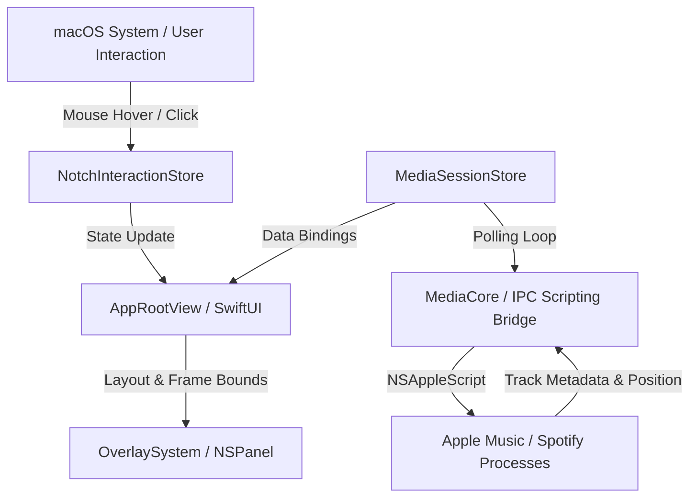

# NookPlayer

NookPlayer is an enterprise-grade macOS utility designed to seamlessly extend the physical MacBook screen notch into an interactive, context-aware media controller. By utilizing native macOS windowing system features (`NSPanel`) and Apple Events Inter-Process Communication (IPC) script bridging, NookPlayer integrates system-wide media controls directly into the screen's bezel, eliminating visual clutter while maintaining immediate accessibility.

---

## Architecture

NookPlayer is built on an asynchronous, state-driven model that bridges SwiftUI user interfaces with system-level scripting APIs. 

### System Design and Data Flow



#### Core Components
1. **NotchInteractionStore**: An event-driven state machine managing interaction states (`bezelEmpty`, `mini`, `peek`, and `expanded`) with optimized dwell timers (50ms enter, 150ms exit) to throttle UI churn.
2. **OverlaySystem**: Manages the custom borderless `NSPanel` floating window instance, applying custom screen metrics, frame changes, and shadow parameters.
3. **NotchGeometry**: Calculates relative coordinates and screen offsets to keep the interface attached directly to the center-top macOS menu bar coordinate bounds.
4. **MediaCore**: An active adapter registry querying track metadata, durations, and play states from macOS target applications via high-performance scripting pipelines.

---

## Prerequisites

### Operating System
- macOS 14.0 (Sonoma) or newer.

### Hardware
- Optimized for Apple Silicon MacBooks featuring a physical notch, but compatible with standard displays.

### Tooling
- Xcode 15.0+ or Swift Toolchain 5.9+.
- Git (for repository operations).

---

## Installation

To clone and compile NookPlayer locally, execute the following command sequence:

```bash
# Clone the repository
git clone https://github.com/muhvarriel/nook-player.git
cd nook-player

# Compile package using Swift Package Manager
swift build -c release
```

---

## Configuration

NookPlayer does not require external environment variables. System parameters are configured at the application level via the menu bar preferences menu:

- **Preferred Provider**: Restricts playback tracking to a designated target:
  - `Auto`: Automatically detects active streams.
  - `Apple Music`: Targets Apple Music exclusively.
  - `Spotify`: Targets Spotify Client exclusively.

- **Automation Permissions**: Access to scripting interfaces requires sandbox-level User Consent. Permissions are requested dynamically upon launching the application or via the Menu Bar under `Check Scripting Permissions`.

---

## Usage

### Building and Packaging
To package the final production application bundle (`NookPlayer.app` with icons and entitlements), run the provided packaging script:

```bash
# Make script executable (if needed)
chmod +x Packaging/build-app.sh

# Run compilation and bundle assembler
./Packaging/build-app.sh
```
The output package will be generated at `build/NookPlayer.app`.

### Launching the Application
You can run the compiled binary or launch the packaged application:

```bash
# Launch directly via CLI
./build/NookPlayer.app/Contents/MacOS/NookPlayer
```

---

## Testing

NookPlayer incorporates test structures for validating playback state transitions and script parser adapters.

### Running Test Suite
Execute the package tests through the Swift Toolchain:

```bash
swift test
```

---

## Project Structure

```txt
nook-player/
├── Packaging/
│   ├── Info.plist            # Application bundle metadata
│   ├── entitlements.plist    # Apple Sandbox entitlements configuration
│   └── build-app.sh          # Compile, package, and sign automation script
├── Resources/
│   ├── Fonts/                # Typography resources (Outfit Font family)
│   ├── AppIcon.icns          # Packaged macOS application icon
│   └── logo-nookplayer.webp  # Status bar menu graphic
├── Sources/
│   └── NookPlayer/
│       ├── main.swift                 # Application entry point and Delegate
│       ├── Views.swift                # Custom SwiftUI layout components
│       ├── NotchGeometry.swift        # Screen coordinates and adaptive frame calculations
│       ├── NotchInteractionStore.swift# Dwell and collapse timing state machine
│       ├── MediaCore.swift            # Media adapters scheduler and metadata store
│       ├── MediaProviders.swift       # AppleScript IPC integrations
│       ├── PermissionState.swift      # Sandbox automation checker
│       ├── SettingsStore.swift        # User preference persistence
│       └── OverlaySystem.swift        # NSPanel overlay lifecycle coordinator
└── Package.swift             # Swift Package Manager configuration manifest
```

---

## Contributing

1. **Coding Standards**: Adhere strictly to the Swift API Design Guidelines. Keep layouts top-attached, centered, and optimized for performance to minimize CPU utilization during IPC polling.
2. **Pull Requests**:
   - Create a feature branch matching `feature/name` or `bugfix/issue-id`.
   - Ensure all changes compile under release configuration (`swift build -c release`).
   - Re-sign application bundles and confirm Sandbox scripting compatibility.

---

## License

This software is distributed under the proprietary license of the respective repository owners. All rights reserved. Unauthorized reproduction or dissemination is strictly prohibited.
